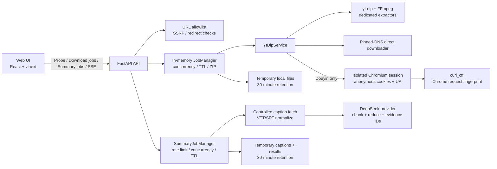

# 视频下载与 AI 总结 MVP 阶段交接

> 文档日期：2026-07-23
> 对应版本：`main` / `8cd1e8d` 及其后续文档提交
> 核心依赖：`yt-dlp 2026.7.4`、FastAPI、FFmpeg、Chromium、`curl_cffi`

## 1. 阶段结论

视频下载 MVP 主链路和首期视频 AI 总结三阶段已经完成，可以进入产品验收。

当前产品能够让用户提交一个或最多十个公开媒体链接，分析媒体信息，选择视频或音频输出，查看实时进度，并下载单文件或 ZIP。系统不接收访客 Cookie，不尝试绕过 DRM、付费墙、私有内容或其他访问控制。

对于两小时以内、具有可用字幕的 YouTube 与 Bilibili 单视频，用户还可以在分析结果中创建英文 AI 总结，查看处理阶段、概览、时间轴、知识点及原语言时间戳证据，并可取消、重试或复制不含完整字幕的总结。

本阶段最重要的工程成果是：在安全 URL 边界内封装了 `yt-dlp`，并针对抖音完成了无需个人账号的匿名浏览器会话、Cookie、User-Agent 和 TLS 请求指纹组合方案。两条真实抖音链接已分别完成 1080p 和 720p 下载验证。

## 2. 已完成范围

| 能力 | 当前状态 | 说明 |
| --- | --- | --- |
| 单链接分析与下载 | 完成 | 视频元数据、可用格式、封面、作者和时长 |
| 批量下载 | 完成 | 单批最多 10 项，允许部分成功 |
| 输出格式 | 完成 | Best、按源文件能力提供 MP4 档位、MP3、公开直链原文件 |
| 实时进度 | 完成 | SSE 推送队列、开始、进度、完成、失败和 ZIP 事件 |
| 单文件与 ZIP | 完成 | 文件完成后可单独下载，多项任务可生成 ZIP |
| 取消与超时 | 完成 | 取消子进程、单项一小时默认超时 |
| 自动清理 | 完成 | 任务完成后默认保留 30 分钟 |
| 平台目录 | 完成 | URL 目录覆盖 66 个大陆与境外平台域名族 |
| 短链接 | 完成 | 受控重定向、平台一致性检查、私网地址阻断 |
| 抖音公开链接 | 完成 | `jingxuan?modal_id=` 规范化、匿名 Cookie、Chrome 指纹 |
| 运行健康检查 | 完成 | 检查 yt-dlp、FFmpeg、JS 运行时、Chromium 和请求指纹能力 |
| 容器化 | 完成配置 | Web/API Compose、Chromium、Node、FFmpeg 和健康检查 |
| 字幕能力探测 | 完成 | YouTube/Bilibili 人工与自动字幕识别、语言优先级和安全下载 |
| AI 总结后端 | 完成 | 独立任务队列、SSE、DeepSeek 分块总结、证据 ID 校验和 TTL |
| AI 总结前端 | 完成 | 可用性原因、进度、取消/重试、概览、大纲、知识点和证据展开 |
| AI 隐私披露 | 完成 | 操作前提示、DeepSeek 数据说明、30 分钟保留期和风险提示 |

“平台目录支持”表示 URL 可以通过安全校验并交给对应的 `yt-dlp` 专用 extractor，不代表该平台的所有链接在所有地区、网络和时间点都必然成功。

## 3. 当前架构



主要代码入口：

- 前端交互：[`free-media-download-frontend/app/components/download-studio.tsx`](../free-media-download-frontend/app/components/download-studio.tsx)
- API 路由与健康检查：[`free-media-download-backend/app/main.py`](../free-media-download-backend/app/main.py)
- 探测与下载封装：[`free-media-download-backend/app/downloader.py`](../free-media-download-backend/app/downloader.py)
- 任务、SSE、ZIP 与清理：[`free-media-download-backend/app/jobs.py`](../free-media-download-backend/app/jobs.py)
- URL 安全与平台目录：[`free-media-download-backend/app/security.py`](../free-media-download-backend/app/security.py)
- 抖音匿名会话：[`free-media-download-backend/app/browser_session.py`](../free-media-download-backend/app/browser_session.py)
- 配置入口：[`free-media-download-backend/app/config.py`](../free-media-download-backend/app/config.py)
- 字幕选择与规范化：[`free-media-download-backend/app/transcripts.py`](../free-media-download-backend/app/transcripts.py)
- 总结任务与 SSE：[`free-media-download-backend/app/summary_jobs.py`](../free-media-download-backend/app/summary_jobs.py)
- DeepSeek 与证据校验：[`free-media-download-backend/app/summary_provider.py`](../free-media-download-backend/app/summary_provider.py)
- AI 总结前端与无障碍交互：[`free-media-download-frontend/app/components/download-studio.tsx`](../free-media-download-frontend/app/components/download-studio.tsx)
- AI 数据披露：[`free-media-download-frontend/app/privacy/page.tsx`](../free-media-download-frontend/app/privacy/page.tsx)

## 4. 核心设计决策

### 4.1 安全边界

- 仅接受 `http` 和 `https`，拒绝账号密码形式 URL 和自定义端口。
- 平台链接必须匹配服务端维护的域名目录；相似域名攻击会被拒绝。
- `yt-dlp` 禁用 generic extractor，只允许专用 extractor。
- 公开媒体直链使用独立下载器；每次跳转都校验域名解析结果并固定公共 IP。
- 阻断 loopback、私网、链路本地、保留地址、云元数据地址和跨平台短链跳转。
- 子进程使用参数数组启动，不经过 shell；用户不能注入任意 yt-dlp 参数。
- 仅允许服务端定义的格式预设、文件上限和时长上限。

### 4.2 任务模型

- 任务状态当前保存在 API 进程内存中。
- 每项下载独立执行，默认最多同时处理两项。
- 批量任务允许部分成功；只要存在成功项，任务即可完成并按需生成 ZIP。
- SSE 事件带递增序号，前端可显示实时进度；同时保留 GET 快照接口。
- API 重启会丢失任务状态；临时文件由 TTL 清理，不是永久媒体库。

### 4.3 格式策略

- `best`：选择最佳可用视频/音频并合并或转封装为 MP4。
- `mp4-<height>`：仅展示源文件实际范围内的标准档位，下载该高度及以下的最佳版本。
- `mp3`：通过 FFmpeg 提取高质量音频。
- 公开媒体直链：保留原文件，不进行不必要的转码。
- 当前单文件上限 2 GB、ZIP 上限 4 GB、单媒体时长上限 6 小时。

### 4.4 AI 总结产品边界

- 首期仅支持 YouTube 与 Bilibili 单视频，输出固定为英文。
- 仅使用平台人工或自动 VTT/SRT 字幕；无字幕时返回 `NO_CAPTIONS`，不下载音频、不执行 ASR。
- 字幕选择顺序为英文人工、原语言人工、英文自动、原语言自动；弹幕和烧录字幕不属于可用字幕。
- 前端在创建任务前明确提示字幕文本会发送给 DeepSeek，视频和音频不会发送。
- 总结任务与下载任务彼此独立；用户可以查看阶段进度、取消、失败后重试，并继续正常下载。
- 模型只返回服务端生成的字幕片段 ID；前端显示的证据文本和时间戳均由服务端回填。
- “复制总结”不包含证据原文或完整字幕；证据通过可展开区域查看，并可跳回原视频时间点。
- 临时字幕、任务状态和结果在完成 30 分钟后清理，前端同时提示 AI 可能出错并要求核对证据。

## 5. 抖音专项方案沉淀

### 5.1 已确认的失败原因

抖音问题不是单一 Cookie 问题，而是以下条件的组合：

1. `jingxuan?modal_id=<id>` 不是 yt-dlp 专用 extractor 直接识别的标准视频路径。
2. 无 Cookie 时，详情接口可能返回空内容，并要求新的匿名 Cookie。
3. 只有 Cookie 和 User-Agent 仍可能被 TLS/浏览器请求指纹校验拒绝。
4. 运行进程如果使用了未安装 `curl_cffi` 的另一套虚拟环境，会出现 `Impersonate target "chrome" is not available`。

### 5.2 当前解决方案

- 将合法的 `modal_id` 链接转换为 `https://www.douyin.com/video/<id>`。
- 第一次公开抖音请求启动隔离的临时 Chromium profile。
- 等待抖音签发所需匿名 Cookie，只导出 `douyin.com` 域 Cookie。
- Cookie 文件权限为 `0600`，默认缓存 20 分钟，服务正常关闭时删除。
- 将同一浏览器 User-Agent 传给 yt-dlp。
- 使用 yt-dlp 的 `curl-cffi` extra 和 `--impersonate chrome` 匹配请求指纹。
- 探测仍返回 Cookie 错误时，强制刷新会话并自动重试一次。
- 显式配置的运营方 Cookie 优先于自动匿名会话。

### 5.3 运行约束

- 开发和生产必须统一使用安装了 [`free-media-download-backend/requirements.txt`](../free-media-download-backend/requirements.txt) 的虚拟环境。
- 不要让前端连接一个 API 端口，而调试器在另一个端口启动新版本。
- `GET /api/v1/health` 必须同时满足：
  - `status: "ok"`
  - `anonymous_browser: true`
  - `request_impersonation: true`
- Cookie、User-Agent、yt-dlp 和浏览器应使用同一出口 IP。
- 该方案提升公开链接成功率，但不能保证抖音未来不调整验证流程。

## 6. 平台兼容现状

URL 目录当前覆盖 66 个平台域名族。代表性真实链接结果记录在 [`platform-compatibility.md`](platform-compatibility.md)。

已验证通过的代表性平台包括：

- 大陆：Bilibili、抖音、微博、腾讯视频、优酷、芒果 TV、虎牙视频。
- 境外：YouTube、Instagram、Vimeo。

已知严格平台或上游缺口：

- Xigua：当前样本要求 Cookie。
- TikTok：当前开发网络出口被平台拒绝。
- Xiaohongshu：当前样本出现上游 extractor 无格式结果。
- iQIYI：现有样本不足以形成稳定结论。
- Douyu VOD：上游 extractor 仍依赖已过时的 PhantomJS。
- Kuaishou：固定的 yt-dlp 版本没有专用 extractor，因此未加入目录。

下一阶段不应只继续增加域名；应建立“黄金样本 + 定时探测 + 结果分级”的平台兼容管理机制。

## 7. API 交接

| 方法 | 路径 | 用途 |
| --- | --- | --- |
| GET | `/api/v1/health` | 运行时依赖与指纹能力健康检查 |
| POST | `/api/v1/media/probe` | 分析链接并返回媒体与格式预设 |
| POST | `/api/v1/jobs` | 创建单项或批量下载任务 |
| GET | `/api/v1/jobs/{job_id}` | 获取任务快照 |
| GET | `/api/v1/jobs/{job_id}/events` | 订阅 SSE 任务事件 |
| GET | `/api/v1/jobs/{job_id}/files/{item_id}` | 下载已完成的单文件 |
| GET | `/api/v1/jobs/{job_id}/bundle` | 下载 ZIP |
| DELETE | `/api/v1/jobs/{job_id}` | 取消任务并删除临时文件 |
| POST | `/api/v1/summaries` | 创建单视频字幕总结任务 |
| GET | `/api/v1/summaries/{summary_id}` | 获取总结任务与结构化结果 |
| GET | `/api/v1/summaries/{summary_id}/events` | 订阅总结阶段与进度 SSE |
| DELETE | `/api/v1/summaries/{summary_id}` | 取消总结并删除临时字幕 |

API 错误使用稳定的 `code`、可读 `message` 和 `retryable`。已区分 Cookie、浏览器、请求指纹、IP 阻断、地区限制、限流、DRM、登录、格式变化、文件过大、超时和运行时缺失等场景。

媒体探测结果还会返回 `summary_supported`、`caption_languages` 和
`transcript_strategy_hint`。当前只有 YouTube 与 Bilibili 会进入字幕总结能力判断；
返回内容仅包含语言标识，不包含平台签名字幕地址，也没有公开完整字幕接口。

总结任务与下载任务使用独立的内存队列和并发限制。字幕按约 12,000 字符分块发送给
DeepSeek，先生成分块 JSON，再汇总为最终英文概览、时间轴大纲和知识点。模型只能返回
字幕片段 ID；服务端会丢弃不存在的 ID，并用原字幕片段补全证据文本与时间戳。

## 8. 配置与启动

前端和后端环境变量样例分别位于 [`free-media-download-frontend/.env.example`](../free-media-download-frontend/.env.example) 与 [`free-media-download-backend/.env.example`](../free-media-download-backend/.env.example)。最重要的运行值如下：

| 配置 | 默认值 | 说明 |
| --- | --- | --- |
| `NEXT_PUBLIC_API_BASE_URL` | 未设置 | 可选；设置后浏览器直接访问独立部署的公共 API |
| `SAVEBOLT_API_ORIGIN`（前端服务端） | `http://127.0.0.1:8000` | 本地同源 `/api/v1` 代理的固定上游地址 |
| `SAVEBOLT_MAX_BATCH_ITEMS` | `10` | 每批最大项目数 |
| `SAVEBOLT_WORKER_CONCURRENCY` | `2` | 同时处理的项目数 |
| `SAVEBOLT_JOB_TTL_SECONDS` | `1800` | 完成文件保留时间 |
| `SAVEBOLT_SUMMARY_MAX_DURATION_SECONDS` | `7200` | 字幕总结允许的最长视频时长 |
| `SAVEBOLT_SUMMARY_CAPTION_TIMEOUT_SECONDS` | `120` | 字幕下载最长等待时间 |
| `SAVEBOLT_SUMMARY_DAILY_LIMIT` | `5` | 单 IP 滚动 24 小时总结任务上限 |
| `SAVEBOLT_SUMMARY_WORKER_CONCURRENCY` | `2` | 同时执行的总结任务数 |
| `SAVEBOLT_SUMMARY_JOB_TTL_SECONDS` | `1800` | 总结结果和临时字幕保留时间 |
| `SAVEBOLT_SUMMARY_REQUEST_TIMEOUT_SECONDS` | `60` | 单次 AI 请求超时 |
| `SAVEBOLT_SUMMARY_CHUNK_CHARACTERS` | `12000` | 字幕分块目标字符数 |
| `DEEPSEEK_BASE_URL` | `https://api.deepseek.com` | DeepSeek OpenAI 兼容 API 根地址 |
| `DEEPSEEK_MODEL` | `deepseek-v4-flash` | 默认总结模型，可由部署环境覆盖 |
| `DEEPSEEK_API_KEY` | 未设置 | 仅通过未跟踪环境文件或部署密钥注入 |
| `SAVEBOLT_ANONYMOUS_BROWSER_COOKIES` | `true` | 启用抖音自动匿名会话 |
| `SAVEBOLT_BROWSER_IMPERSONATE` | `chrome` | yt-dlp 请求指纹目标 |
| `SAVEBOLT_BROWSER_SESSION_TTL_SECONDS` | `1200` | 匿名会话缓存时间 |
| `SAVEBOLT_YTDLP_PROXY` | 未设置 | 运营方管理的固定出口代理 |

推荐本地使用唯一的 API 环境：

```bash
cd free-media-download-backend
python3.12 -m venv .venv
.venv/bin/pip install -r requirements-dev.txt
PATH="$PWD/.venv/bin:$PATH" \
PYTHONPATH=. \
SAVEBOLT_YTDLP_BINARY="$PWD/.venv/bin/yt-dlp" \
.venv/bin/uvicorn app.main:app --reload --port 8000 --env-file .env
```

后端会优先自动发现当前 Python 虚拟环境 `bin` 目录中的 `yt-dlp`，因此从 IDE 或
`.venv/bin/uvicorn` 启动时不再依赖系统 PATH；`SAVEBOLT_YTDLP_BINARY` 仍可用于显式覆盖。
本地 `.env` 不会由 `app.config` 自动读取，启动命令必须保留 `--env-file .env`，否则即使
文件中已经配置 `DEEPSEEK_API_KEY`，运行中的 API 仍会返回 `SUMMARY_PROVIDER_UNAVAILABLE`。

本地开发默认不设置 `NEXT_PUBLIC_API_BASE_URL`。浏览器访问当前前端域名下的 `/api/v1`，
再由前端 Route Handler 转发到 `SAVEBOLT_API_ORIGIN`。这样即使浏览器预览环境中的
`localhost` 与宿主机不是同一个网络上下文，AI 总结和 SSE 仍会到达已加载 `.env` 的 API。
只有独立部署公共 API 时才配置 `NEXT_PUBLIC_API_BASE_URL`。若使用 Docker：

```bash
docker compose up --build
```

## 9. 验证证据

本阶段最后一次回归结果：

- API：111 项测试通过，已分别在 Python 3.12 和实际调试使用的 Python 3.13 环境验证。
- Web：生产构建成功，3 项渲染/法律页面/可访问性测试通过。
- ESLint：通过。
- `docker compose config`：通过。
- `git diff --check`：通过。

自动化覆盖范围包括：

- 平台 URL allowlist、相似域名、私网地址和 SSRF。
- 抖音 URL 规范化、匿名 Cookie 文件权限、会话缓存与清理。
- 请求指纹依赖检测和明确错误映射。
- 探测缓存与并发请求合并。
- 格式档位、文件大小、时长、超时和取消。
- SSE 顺序、部分失败、ZIP、TTL 清理和限流。
- 字幕语言优先级、VTT/SRT 标准化、总结分块、DeepSeek 错误重试、证据 ID 校验与总结任务生命周期。
- 前端 SSR、法律页面、可访问性和产品声明。

真实抖音验证：

| 视频 ID | 结果 |
| --- | --- |
| `7636370662940085510` | 元数据探测成功，1080p MP4 下载成功，文件约 9.5 MB |
| `7651948700725447942` | 页面分析成功，720p MP4 下载成功，文件约 109.8 MB，并出现下载链接 |

真实 AI 总结验证：

| 样例 | 结果 |
| --- | --- |
| 两段人工构造英文字幕 | DeepSeek 凭证、JSON 汇总和证据解析链路通过，仅引用两个真实片段 ID |
| 20:50 英文 TED 视频 | 428 个字幕片段分为 3 块，生成 13 个有序大纲、12 个知识点和 92 条证据；全部证据 ID 均来自原字幕 |
| 14:04 英文 TED 视频（阶段三 UI 验收） | 前端探测显示 64 个可用字幕轨道并启用入口；真实 API 任务完成，使用英文人工字幕，生成 12 个有序大纲、12 个知识点和 84 条有效证据 |

阶段三前端验收还确认：

- Bilibili 无字幕样例显示 `No usable captions`，AI Summary 按钮不可操作，下载格式仍正常可选。
- YouTube 有字幕样例在操作前显示 AI 数据传输提示，AI Summary 按钮可操作。
- 处理中提供具名 `progressbar`、阶段说明、百分比和取消按钮；失败或取消状态提供重试。
- 完成结果包含概览、时间轴、知识点、可展开证据和跳转源视频的时间戳链接。
- 复制内容只包含总结、时间点和源链接，不复制证据原文或完整字幕。
- 移动端断点将媒体操作、结果元信息、时间轴与知识点切换为单列；所有操作使用原生按钮、链接、`details` 和具名区域，可由键盘及辅助技术访问。
- 本地页面的 API、下载文件和 SSE 均通过同源代理转发；真实验证得到 health 200、总结创建 201、取消 204，并保持 `queued → started → fetching_captions` 流式事件顺序。

## 10. 当前边界与技术债

### 10.1 上线前必须处理

- 任务和限流状态仅在单进程内存中，不支持多实例一致性。
- 文件只保存在本地临时磁盘，不适合弹性扩容或实例迁移。
- 没有生产级日志聚合、指标、追踪、告警和平台成功率看板。
- 没有正式的部署流水线、容器镜像扫描和生产烟雾测试。
- Cookie/代理配置仍依赖运营方环境变量或挂载文件，需要正式秘密管理。
- 法律联系信息、滥用处理、隐私与目标市场合规仍是占位状态。

### 10.2 可接受的 MVP 限制

- 上游平台变化会导致 extractor 短期失效。
- IP reputation、地区和平台频率限制无法仅靠代码消除。
- 不支持 DRM、付费、私有或需要账号授权的媒体。
- 浏览器匿名会话首次建立会增加探测延迟。
- API 重启后，进行中的任务不可恢复。

## 11. 下一阶段建议

### P0：先把可运行 MVP 变成可运营服务

1. 明确部署拓扑：单机、容器平台或云服务。
2. 将任务状态迁移到 Redis/PostgreSQL，并引入可恢复队列。
3. 将输出文件迁移到对象存储，使用短时签名下载 URL。
4. 建立结构化日志、指标、追踪和告警。
5. 建立平台黄金样本库与定时兼容探测。
6. 使用秘密管理保存运营 Cookie、代理和其他敏感配置。
7. 增加 API 全局并发、带宽、磁盘和出口成本保护。

### P1：提升可靠性与体验

1. 为平台建立能力状态：可用、需要 Cookie、地区受限、上游故障。
2. 增加平台级重试、退避、熔断和失败原因统计。
3. 建立固定 yt-dlp 升级节奏和回归矩阵，不在生产中自动更新。
4. 增加任务恢复、断点续传和大文件流式交付策略。
5. 将前端错误完整本地化，并展示可操作的恢复建议。
6. 增加 E2E 测试，覆盖分析、选择格式、下载、取消和批量部分失败。

### P2：再考虑产品扩展

- 账号、历史记录、保存的格式偏好。
- 付费套餐、配额、优先队列和成本归因。
- 字幕、封面、元数据导出、摘要等衍生能力。
- 在真实需求与上游支持明确后，继续增加平台。

## 12. 下一阶段启动前的产品决策

开始 P0 前需要确定以下问题，否则基础设施容易返工：

1. 产品继续完全匿名，还是引入账号和下载历史？
2. 首个生产区域、目标用户地区和平台优先级是什么？
3. 文件保留时长、隐私承诺和滥用响应 SLA 是什么？
4. 单用户与全站的带宽、存储、并发和成本上限是多少？
5. 对 Cookie、代理、地区限制平台采取支持、降级还是暂不开放策略？
6. 下一阶段成功标准更偏向平台覆盖、下载成功率，还是商业化验证？

## 13. 建议的下一阶段验收标准

- 所有生产实例的健康检查能验证完整下载依赖，而不仅是进程存活。
- 黄金样本探测结果可观察，失败能按平台与错误码聚合。
- API 与 Worker 可水平扩展，任务不会因单实例重启丢失。
- 临时文件不落永久本地盘，下载 URL 有明确有效期。
- 配置和秘密不进入代码、日志、公共 API 或容器镜像。
- 发布前自动执行单元测试、E2E、镜像扫描和代表性平台烟雾测试。
- 发生上游平台故障时，产品能够降级并给出真实、可操作的提示。

## 14. 交接清单

- [ ] 确认工作区使用唯一、依赖完整的 API 虚拟环境。
- [ ] 启动后检查 `/api/v1/health` 的全部字段。
- [ ] 确认前端 API Base URL 与实际 API 端口一致。
- [ ] 在目标部署网络重新执行平台黄金样本。
- [ ] 在有 Docker daemon 的环境执行完整镜像构建与容器 E2E。
- [ ] 确认 FFmpeg、Node、Chromium 和 `curl_cffi` 版本。
- [ ] 为 Cookie、代理、临时文件和日志制定生产安全策略。
- [ ] 选定下一阶段 P0 的部署与持久化方案。

## 15. 关联文档

- 项目运行与配置：[`README.md`](../README.md)
- 平台兼容矩阵：[`docs/platform-compatibility.md`](platform-compatibility.md)
- 前端环境变量：[`free-media-download-frontend/.env.example`](../free-media-download-frontend/.env.example)
- 后端环境变量：[`free-media-download-backend/.env.example`](../free-media-download-backend/.env.example)
- 第三方依赖许可：[`THIRD_PARTY_NOTICES.md`](../THIRD_PARTY_NOTICES.md)
