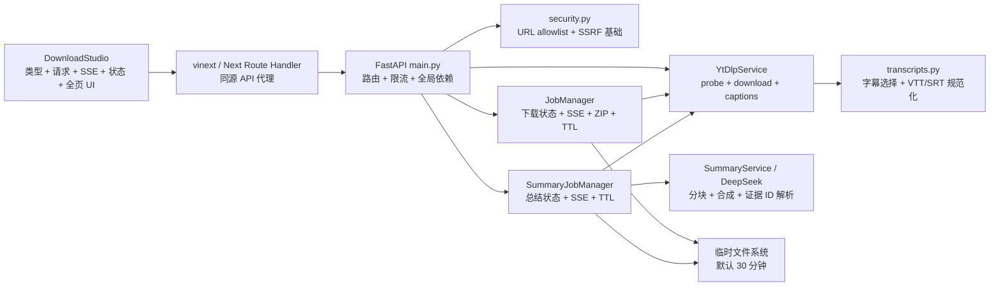
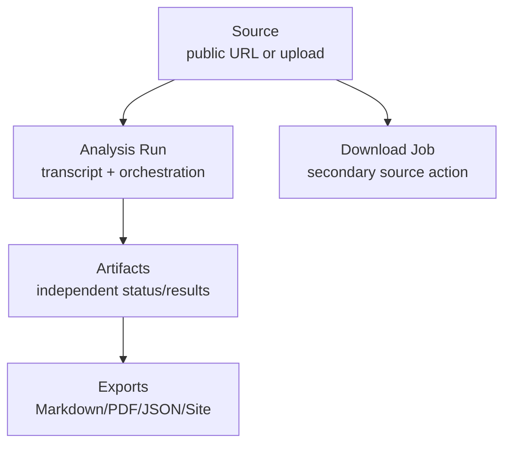

# SaveBolt AI Video Knowledge Workspace 技术设计

> 文档状态：设计评审稿  
> 审计基线：Git commit `44533a3`（`support AI summery`）  
> 审计日期：2026-07-23  
> 适用范围：`free-media-download-frontend`、`free-media-download-backend` 及其测试  
> 本阶段约束：只产出设计，不修改业务代码

## 1. 执行摘要

SaveBolt 当前是一个边界清晰、具备基本安全防护的公共媒体下载 MVP，并在 YouTube/Bilibili 字幕之上增加了证据可追溯的英文总结。现有实现适合作为后续演进的兼容基线，但不能直接承载“任意公开视频 → 多种知识形态”的产品目标，主要原因如下：

1. 字幕获取被嵌入 `SummaryJobManager`，不存在“字幕优先、ASR 回退”的 Transcript acquisition 策略层。
2. `SummaryResult` 只容纳 Overview、Outline 和 Key Points；任务、Provider prompt 和前端结果 UI 都依赖这个固定形状。
3. `download-studio.tsx` 同时拥有 API 类型、网络请求、两个 SSE 客户端、下载状态、总结状态、营销页面和结果渲染，任何新输出都会继续放大耦合。
4. `downloader.py` 同时负责探测缓存、yt-dlp 命令、直链 HTTP、短链、安全会话、字幕下载和媒体下载，已经成为后端的第二个单体。
5. 下载任务和总结任务各自维护一套内存状态、事件列表、清理循环和取消逻辑；大结果若继续嵌入每个 SSE 快照，会出现明显的内存与带宽放大。
6. 当前事实校验只证明“模型引用的 segment ID 存在”，不能证明生成事实与证据语义一致；Overview 甚至没有证据字段。
7. 当前输出语言被 Pydantic 固定为 `en`，Provider prompt 也硬编码英文，页面 `lang="en"`，并不具备统一多语言基础。

本设计建议采用以下核心决策：

- 保留下载任务为独立、次级能力；新增统一 Analysis 任务，产品层级变为 **Source → Analysis → Knowledge Artifacts → Export/Download**。
- 将 Transcript 作为第一等、可序列化的领域对象，使用策略链完成 `captions → temporary audio → ASR → normalization`。
- 以 `ContentAnalysis` 作为统一结果，以独立 Artifact generator registry 扩展 Summary、Chapters、Mind Map、Visual Story、Dynamic Website 和 Interactive Guide。
- 旧 `/api/v1/summaries` 和 `SummaryResult` 暂时保留，由兼容适配器调用新管线，至少经过一个完整发布周期后再弃用。
- Dynamic Website 不接收或执行模型 HTML/JavaScript/CSS；模型只生成严格的安全 UI IR，由受控 renderer 渲染。
- 新 Analysis SSE 只推送小型状态增量，完整 Transcript 和 Artifact 通过独立结果接口读取。
- Phase 0 先完成模型、接口边界和兼容适配，不同时上线 ASR 和所有知识形态。

## 2. 审计范围与验证基线

### 2.1 已审计文件

前端：

- `free-media-download-frontend/app/components/download-studio.tsx`
- `free-media-download-frontend/app/globals.css`
- `free-media-download-frontend/app/page.tsx`
- `free-media-download-frontend/app/layout.tsx`
- `free-media-download-frontend/app/api/v1/[...path]/route.ts`
- `free-media-download-frontend/app/privacy/page.tsx`
- `free-media-download-frontend/app/terms/page.tsx`
- `free-media-download-frontend/tests/rendered-html.test.mjs`

后端：

- `free-media-download-backend/app/main.py`
- `free-media-download-backend/app/models.py`
- `free-media-download-backend/app/config.py`
- `free-media-download-backend/app/downloader.py`
- `free-media-download-backend/app/transcripts.py`
- `free-media-download-backend/app/summary_jobs.py`
- `free-media-download-backend/app/summary_provider.py`
- `free-media-download-backend/app/jobs.py`
- `free-media-download-backend/app/security.py`
- `free-media-download-backend/app/browser_session.py`
- 全部后端测试、依赖清单、环境变量样例与 Docker Compose 配置

### 2.2 实际验证结果

| 检查 | 结果 |
|---|---:|
| 后端 Pytest | 111 passed |
| 前端生产构建 | passed |
| 前端 Node tests | 3 passed |
| 前端 ESLint | passed |
| 审计前工作区 | clean |

这些结果证明当前行为有稳定基线，不代表目标架构已经被覆盖。尤其前端的第三项测试主要读取源码并做正则断言，不是浏览器交互测试。

### 2.3 关键审计发现

| 优先级 | 位置 | 发现 | 影响 |
|---|---|---|---|
| P0 | `download-studio.tsx:7–110,259–543,545–927` | 类型、请求、两个 SSE client、状态和整页 UI 集中在一个 Client Component | 新增 artifact 会同时改网络、状态和展示，回归面持续扩大 |
| P1 | `download-studio.tsx:326–335` | `changeMode()` 关闭 Summary EventSource，但没有关闭 Download EventSource | 切换模式后旧下载事件仍可能把已清空的 UI state 写回来 |
| P1 | `download-studio.tsx:347–388` | 批量 probe 串行执行，任意失败会使本次成功结果不提交；开始新 probe 时没有清空旧 Summary | 批量体验缺少 partial success，并可能展示与新 source 无关的旧总结 |
| P1 | `download-studio.tsx:538–543` | Download cancel 忽略 HTTP 失败并乐观更新状态 | 服务端未取消时 UI 仍显示 cancelled |
| P0 | `downloader.py:265–971` | Probe、下载、直链 HTTP、短链、平台 session 和字幕获取共存 | ASR/audio 再加入会形成不可测试的媒体单体 |
| P1 | `jobs.py:132–147` | 所有 item 都失败时 status 是 failed，但 terminal SSE event 仍名为 `completed` | 客户端和观测系统无法仅凭事件名判断成功/失败 |
| P0 | `jobs.py:253–286`、`summary_jobs.py:227–263` | 每个事件保存并发送完整 job snapshot | Transcript/多 artifact 加入后出现内存和带宽平方级放大 |
| P1 | `summary_jobs.py:204–225` | 对已完成 Summary 调用 DELETE 不会清除内存 result 或变更终态 | “删除/清除”语义不完整，和隐私预期不一致 |
| P0 | `models.py:127–174` | 输出语言固定英文，Summary 形状固定，Overview 无 evidence | 无法承载多语言和可扩展知识 artifact |
| P0 | `transcripts.py:24–50` | Transcript 使用 dataclass 和 `start/end` | 不满足严格 JSON/Pydantic 和统一时间字段要求 |
| P1 | `summary_provider.py:124–248` | Prompt 和 token budget 硬编码英文/固定规模 | 长内容仍被压缩为少量固定输出 |
| P1 | `summary_provider.py:311–381` | 只验证 evidence ID 存在，不验证语义支持；Overview 不校验证据 | 真实 ID 可被用于“证据洗白”无关事实 |
| P1 | `main.py:36–55` | 限流器和所有 service/manager 为进程全局对象 | 多 worker 不一致、测试需 monkeypatch 单例、状态重启丢失 |
| P1 | `main.py:36–48` | Rate limiter 只在同 key 再访问时清理 bucket，全局 key 数无上限 | 分布式来源或长运行实例可能持续增加内存 |
| P1 | `globals.css:3–431` | 表现型 token 和所有 feature 样式处于 global scope | 多语言、Workspace 和图形视图难以独立演进 |
| P1 | `rendered-html.test.mjs:40–77` | 大量前端“覆盖”是源码正则存在性断言 | 不能捕获状态竞争、SSE 重连和真实可访问性交互问题 |

## 3. 当前架构与完整调用链

### 3.1 总览



### 3.2 媒体探测调用链

1. `DownloadStudio.analyze()` 将输入按空白/换行拆分、去重，最多保留 10 条；Single 模式拒绝多条链接。
2. 前端逐条、串行调用 `POST /api/v1/media/probe`。任意一条失败会丢弃本次尚未提交到 state 的全部临时成功结果。
3. 同源模式经 `app/api/v1/[...path]/route.ts` 转发。代理：
   - 只允许安全 path segment；
   - 只转发固定请求头；
   - 不转发浏览器 Cookie；
   - 对 upstream 使用 `redirect: "manual"`；
   - 流式转发响应 body。
4. `main.probe()` 使用来源 IP 做 15 分钟 20 次的内存限流。
5. `YtDlpService.probe()` 调用 `classify_url()`：
   - 平台 URL 必须匹配平台域名 allowlist；
   - 非平台 URL 只有路径扩展名是受支持媒体格式时才视为直链；
   - 只允许 HTTP(S)、80/443、无 userinfo。
6. Probe 使用 5 分钟成功缓存；相同规范 URL 的并发请求共享同一个 in-flight task；失败不缓存。
7. 平台 URL：
   - 安全展开已知短链，并要求跳转后仍属于同一平台；
   - 通过 `yt-dlp --dump-single-json --skip-download` 读取元数据；
   - 使用 `--ignore-config` 和 `--use-extractors default,-generic`；
   - 对启用的平台加入服务端 Cookie、User-Agent、Proxy 或受控匿名 Douyin session；
   - Playlist 最多返回 `max_batch_items`；
   - `_normalize_info()` 生成 `MediaItem`、格式 Preset 和字幕能力提示。
8. 直链：
   - 对每一跳重新解析 URL；
   - DNS 结果必须全部是公网地址并被 `PublicResolver` 固定；
   - 最多 4 跳；
   - 检查 Content-Type 和声明的 Content-Length；
   - 只返回 `original` preset。
9. 前端为每个结果选择默认 preset，并直接展示 extractor 返回的 thumbnail、title、platform 等元数据。

### 3.3 下载调用链

1. `DownloadStudio.startDownload()` 调用 `POST /api/v1/jobs`，提交 `url`、服务端允许的 `preset_id` 和显示标题。
2. API：
   - 限制批量数量；
   - 每小时最多创建 5 个下载任务；
   - 再次执行 `classify_url()`；
   - 强制直链只能用 `original`，平台 URL 不能用 `original`。
3. `JobManager.create()`：
   - 生成高熵 job ID 和 item ID；
   - 创建 job 目录；
   - 在进程内 `dict` 保存状态；
   - 发布 `queued`；
   - 启动异步 `_run()`。
4. `_run()` 对 item 创建 task，并由全局 semaphore 限制下载并发。
5. 每个 item：
   - 发布 `item_started`；
   - 调用 `YtDlpService.download()`；
   - 进度回调更新完整 item/job 快照并发布 `item_progress`；
   - 成功发布 `item_ready`，失败发布 `item_failed`。
6. 平台下载：
   - 禁止 playlist、generic extractor 和用户自定义格式表达式；
   - 只使用服务端 preset；
   - 设置最大文件大小、最大时长和 `!is_live`；
   - 使用 FFmpeg 合并/转码；
   - 解析 yt-dlp progress template；
   - 使用进程组终止处理取消。
7. 直链下载：
   - 使用固定 DNS resolver；
   - 每一跳重新验证；
   - 流式写盘；
   - 同时检查声明大小和实际写入大小。
8. 若至少一个 item 成功，job 状态为 `completed`；请求 bundle 时使用 `ZIP_STORED` 生成 ZIP，但超过 bundle 上限时静默不生成。
9. 前端通过 `GET /jobs/{id}/events` 使用 EventSource 监听命名事件；出错时 GET 快照补偿。
10. 用户通过 file/bundle 路由读取文件；单文件路由再次验证文件位于 job 目录内。
11. DELETE job 设置取消标志、终止任务、删除文件；终态默认保留 30 分钟后从内存和磁盘清理。

### 3.4 当前 AI 总结调用链

1. Probe 只有在平台是 YouTube/Bilibili、存在 VTT/SRT 字幕且不超过两小时时才把 `summary_supported` 置为 true。
2. 前端只对满足条件的 item 开启 “AI summary”，调用 `POST /api/v1/summaries`，且 `output_language` 固定为 `en`。
3. API：
   - 再次验证 URL；
   - 只接受 YouTube/Bilibili；
   - 检查服务端 DeepSeek 配置；
   - 按来源 IP 执行滚动 24 小时 5 次限流。
4. `SummaryJobManager.create()` 创建独立 summary 目录、内存状态、`queued` 事件和 task。
5. `_run()` 依次推进：
   - `fetching_captions`；
   - `parsing`；
   - `summarizing`；
   - `finalizing`；
   - `completed`。
6. `YtDlpService.fetch_caption_transcript()`：
   - 重新 probe 单个视频；
   - 拒绝 playlist/多条 entry；
   - 检查两小时时长；
   - 按“首选语言人工字幕 → 原语言人工字幕 → 首选语言自动字幕 → 原语言自动字幕”选轨；
   - 只让 yt-dlp 下载服务器选中的 VTT/SRT，不接受客户端 caption URL；
   - 规范化 HTML tag、样式、重复 rollup 和重叠时间；
   - 生成 `seg-00001` 形式的 segment ID。
7. `SummaryService.generate()`：
   - 以字符数分块，不切开 segment；
   - 每个 chunk 调用 DeepSeek 生成固定的 Overview/Outline/Key Points JSON；
   - 最后再次调用 DeepSeek 合成；
   - Provider 对 429/5xx/网络错误最多重试 3 次；
   - 无效 JSON 允许一次修复请求。
8. `resolve_summary_draft()` 只保留真实存在的 evidence ID，将原字幕文本和时间复制到 `SummaryEvidence`；没有任何有效 outline 或 key point 时失败。
9. 完整 `SummaryResult` 被嵌入 `SummaryJobView`，并在每个 SSE 事件里发送整个 summary 快照。
10. 前端展示 Overview、Timeline、Key Points 和折叠证据，支持复制文本、跳转原视频时间戳、取消与重试。

### 3.5 当前重试语义

- Probe：前端重新点击；成功缓存，失败不缓存。
- Download：后端没有 retry endpoint；前端终态后只能“Start another”重新创建 job。
- Summary：前端失败后用原 source 重新 POST 一个新 summary job。
- Provider：只在一次 summary job 内对网络、429、5xx 和一次 JSON 格式错误做内部重试。
- 重启：所有 in-memory job、事件和结果丢失；磁盘残留只能等新进程的清理逻辑在已知状态上工作，因此孤儿目录没有完整恢复语义。

## 4. 当前主要数据模型

### 4.1 API Pydantic 模型

| 类别 | 模型 | 关键字段/限制 |
|---|---|---|
| 公共错误 | `ErrorBody` | `code`、`message`、`retryable`、`itemIndex` |
| 探测输入 | `ProbeRequest` | URL 字符串 8–4096，strip |
| 探测输出 | `ProbeResponse` | `items`、`truncated` |
| 媒体 | `MediaItem` | source/title/platform/duration/thumbnail/uploader/presets、字幕能力字段 |
| 下载输入 | `CreateJobRequest` | 1–10 items、bundle |
| 下载 item | `CreateJobItem` | URL、受正则限制的 preset、可选 title |
| 下载快照 | `JobView` / `JobItemView` | 状态、进度、错误、文件 URL、TTL |
| 总结输入 | `CreateSummaryRequest` | URL、title、`output_language: Literal["en"]` |
| 总结结果 | `SummaryResult` | source、caption metadata、overview、outline、key_points |
| 总结证据 | `SummaryEvidence` | segment ID、start/end、字幕原文 |
| 总结快照 | `SummaryJobView` | JobStatus、SummaryStage、progress、result、error |
| 健康检查 | `HealthResponse` | yt-dlp/FFmpeg/JS/browser/impersonation 可用性 |

### 4.2 内部非 Pydantic 模型

| 模块 | 模型 | 问题 |
|---|---|---|
| `jobs.py` | `JobState` / `JobItemState` dataclass | 只存在内存；事件存完整快照；与 Summary 状态重复 |
| `summary_jobs.py` | `SummaryJobState` dataclass | 独立的取消、SSE、TTL；不能容纳 artifact 子状态 |
| `transcripts.py` | `CaptionTrack` / `TranscriptSegment` / `TranscriptDocument` dataclass | 字段名是 `start/end`，不是统一 `start_seconds/end_seconds`；不能直接作为严格 API schema |
| `summary_provider.py` | `SummaryDraft`、`TranscriptChunk` | Draft 默认允许忽略额外字段；只支持固定三类内容 |

### 4.3 模型层关键缺口

- API 模型没有统一 `extra="forbid"`，模型返回额外字段时可能被静默丢弃。
- `HttpUrl` 已导入但没有用于 source URL；extractor 元数据中的 URL 仍是普通字符串。
- 时间没有统一范围 validator；`end_seconds > start_seconds` 只由字幕 parser 间接保证。
- API 时间戳是字符串而非 timezone-aware `datetime`。
- `SummaryResult.overview` 没有证据。
- 证据只验证 ID 是否存在，不验证内容是否被相应 segment 支持。
- `SummaryResult` 和任务状态耦合，无法表达某些 artifact 成功、某些失败的 partial result。
- 输出语言、Transcript 语言、UI locale 没有被分开建模。

## 5. 当前 API 路由

| Method | Route | 输入 | 输出/行为 |
|---|---|---|---|
| GET | `/api/v1/health` | 无 | 依赖健康状态 |
| POST | `/api/v1/media/probe` | `ProbeRequest` | `ProbeResponse` |
| POST | `/api/v1/jobs` | `CreateJobRequest` | 201 `CreateJobResponse` |
| GET | `/api/v1/jobs/{job_id}` | job ID | `JobView` |
| GET | `/api/v1/jobs/{job_id}/events` | `Last-Event-ID` | 下载 SSE |
| GET | `/api/v1/jobs/{job_id}/files/{item_id}` | IDs | 文件流 |
| GET | `/api/v1/jobs/{job_id}/bundle` | job ID | ZIP |
| DELETE | `/api/v1/jobs/{job_id}` | job ID | 取消并删除文件 |
| POST | `/api/v1/summaries` | `CreateSummaryRequest` | 201 `CreateSummaryResponse` |
| GET | `/api/v1/summaries/{summary_id}` | summary ID | `SummaryJobView` |
| GET | `/api/v1/summaries/{summary_id}/events` | `Last-Event-ID` | Summary SSE |
| DELETE | `/api/v1/summaries/{summary_id}` | summary ID | 取消；运行中会删除临时目录 |

路由层目前同时承担全局对象创建、错误映射、限流、健康探测和业务校验。随着 Upload、Analysis、Artifact、Export 增加，`main.py` 应退化为应用装配入口，路由进入独立 router。

## 6. 当前 SSE 协议

### 6.1 下载事件

| 事件 | 触发时机 | Payload |
|---|---|---|
| `queued` | job 创建 | sequence、type、item_id、完整 `JobView` |
| `started` | job 开始 | 同上 |
| `item_started` | item 占用 worker | 同上 |
| `item_progress` | yt-dlp/直链进度 | 同上 |
| `item_ready` | item 文件完成 | 同上 |
| `item_failed` | item 失败或取消错误 | 同上 |
| `bundle_ready` | ZIP 完成 | 同上 |
| `completed` | job 结束 | 同上；即使 job status 是 failed，事件名仍是 completed |
| `cancelled` | DELETE job | 同上 |

### 6.2 Summary 事件

| 事件 | 触发时机 | Payload |
|---|---|---|
| `queued` | summary 创建 | sequence、type、完整 `SummaryJobView` |
| `started` | worker 开始 | 同上 |
| `stage_changed` | fetching/parsing/summarizing/finalizing | 同上 |
| `progress` | chunk 或 final progress | 同上 |
| `completed` | 结果完成 | 同上，包含完整 `SummaryResult` |
| `failed` | caption/provider/validation 失败 | 同上 |
| `cancelled` | 取消 | 同上 |

### 6.3 SSE 可保留能力

- 单 job 递增 sequence。
- `Last-Event-ID` 的服务端 replay 基础。
- 15 秒 keep-alive comment。
- GET snapshot 作为 SSE 失败补偿。
- 终态关闭 stream。

### 6.4 SSE 必须修正的问题

1. 下载 job 的 terminal event 名称与实际 `JobStatus.FAILED` 不一致。
2. Progress 事件保存并发送整个 job 快照；结果增大后会造成 `事件数 × 结果大小` 的内存和网络放大。
3. 事件列表在 job 运行期间无上限，高频直链进度可能长期增长。
4. 新协议缺少 `schema_version`、`emitted_at`、artifact kind 和统一 error 字段。
5. 测试验证了 manager 内事件顺序，但没有通过真实 API 测试 `Last-Event-ID` replay、代理头转发、断线重连和 keep-alive。
6. 前端只用 TypeScript assertion 解析 payload，没有 runtime schema validation。

## 7. 可复用模块与必须重构模块

### 7.1 建议保留并抽取的能力

| 现有能力 | 结论 | 目标归属 |
|---|---|---|
| URL 平台 allowlist、相似域名防护 | 保留 | `core/security.py` |
| 公网 DNS 校验和直链 DNS pinning | 保留并补测 | `media/direct_http.py` |
| `safe_filename`、文件目录 containment | 保留 | `core/files.py` |
| `--ignore-config`、禁用 generic extractor、无 shell 子进程 | 保留为硬约束 | `media/yt_dlp_client.py` |
| 短链同平台跳转校验 | 保留 | `media/platform_access.py` |
| Operator Cookie 与 Douyin 匿名 session 隔离 | 保留 | `media/platform_access.py` + `browser_session.py` |
| Probe 成功缓存和 in-flight 合并 | 保留 | `media/probe_service.py` |
| VTT/SRT 选轨、清理、去重、消除 overlap | 保留 | `transcript/captions.py` |
| Provider Protocol、网络重试、JSON repair | 保留思想，改为通用 provider client | `analysis/providers/` |
| 真实 segment ID 解析 | 保留并强化为 grounding validator | `analysis/grounding.py` |
| SSE sequence、keep-alive、snapshot fallback | 保留协议能力 | `jobs/events.py` |
| 前端同源代理和请求头白名单 | 保留并加入安全响应头 | 当前 Route Handler |

### 7.2 必须重构的模块

#### `download-studio.tsx`

必须拆分。927 行组件目前包含：

- 12 组 API/领域类型；
- input parsing；
- probe、download、summary 请求；
- 两个 EventSource 生命周期；
- 13 个 state/ref；
- 下载与总结重试/取消；
- Evidence 渲染；
- 整个 landing page、pricing、FAQ、modal；
- 所有知识结果 UI。

新增 6 种 artifact 后继续修改该文件不可接受。

#### `globals.css`

431 行全部处于 global scope，token 是 `--orange`、`--ink` 这类表现型名称，营销页面、下载器、Summary 和 legal 页面互相共享 selector。应保留 token/reset，全功能样式迁移到 CSS Modules 或明确的 feature layer；同时引入语义 token、CJK/RTL 字体和高对比状态。

#### `main.py`

需要拆成 router + dependency composition。全局单例使测试频繁 monkeypatch 进程对象，也会阻碍替换 repository/queue/provider。

#### `models.py`

需要迁移成按领域组织的严格 Pydantic schema。为兼容旧 import，可在迁移期保留 re-export。

#### `downloader.py`

975 行包含至少六个独立职责：probe、yt-dlp process、direct HTTP、short URL、platform auth/session、caption acquisition、download。ASR 音频处理不能继续添加到这里。

#### `summary_jobs.py`

不应演变为 `analysis_jobs.py` 的复制版。要建立通用 Analysis state、artifact 子状态、持久化 repository 和事件存储。

#### `summary_provider.py`

Provider transport、prompt、Summary schema、chunk orchestration、evidence resolution混在一个文件。应拆成 vendor client、artifact generator 和 grounding validator。

#### `transcripts.py`

Caption parser 可保留，但 Transcript dataclass 必须迁移到严格 Pydantic，并把 acquisition policy 从 downloader 中抽出。

#### `MemoryRateLimiter`

当前只在同一 `(IP, scope)` 再次访问时清理旧 timestamp，唯一 IP key 可以持续增长；它是“单 bucket 有上限”，不是“全局内存有上限”。生产环境还需明确可信代理地址解析，否则反向代理后可能把所有用户视为同一 IP。

## 8. 潜在回归风险

### P0：必须在 Phase 0/2 前控制

1. **旧 Summary 契约破坏**：字段名、事件名或状态变化会直接破坏当前 UI。
2. **SSRF 边界退化**：将字幕、ASR 或 Upload 接入新服务时，若绕过 `classify_url`/专用 extractor，会扩大出站访问面。
3. **模型 HTML/XSS**：Dynamic Website 若直接渲染模型 HTML、Markdown HTML、CSS 或 JavaScript，会形成持久/反射 XSS 和数据外传能力。
4. **大结果 SSE 放大**：Transcript、Story、Website 全部嵌入 job snapshot 后，内存和带宽会快速失控。
5. **临时音频生命周期**：ASR 新增的 audio 文件若不进入统一 artifact manifest 和清理流程，会违反 30 分钟保留承诺。
6. **资源耗尽**：FFmpeg + ASR + LLM 使用不同资源；若共用一个 semaphore 或完全无配额，会拖垮下载任务。

### P1：发布前解决

1. Prompt injection：字幕内容可能要求模型忽略系统指令或生成危险 UI。
2. Evidence laundering：模型可引用真实但无关的 segment ID。
3. 上传炸弹：伪造 MIME、超长媒体、解码炸弹、恶意容器、路径名和磁盘占满。
4. 多语言长度与排版：CJK、RTL、长词、字体 fallback 和复制/导出编码。
5. 任务重启：昂贵 ASR/Artifact 生成在进程重启后丢失。
6. Partial success：某个 artifact 失败时不应把完整 Analysis 标为 failed。
7. Probe 能力过期：Probe 显示有字幕，任务开始时字幕已不可用；需要自动 ASR 回退或明确 reason。

### P2：产品扩展期处理

- 大视频 seek 与分片上传。
- 结果分享权限和长期存储。
- 多用户公平调度、计费和配额。
- Artifact 缓存失效和 provider prompt 版本迁移。
- 多 worker 的事件一致性和任务 lease。

## 9. 安全边界

### 9.1 必须保持的硬边界

- 不绕过 DRM、付费墙、登录限制或访问控制。
- 不接收客户端传入的来源平台 Cookie、Authorization header、caption URL、下载 header、extractor 参数或 provider prompt。
- 只处理用户拥有或获得授权的公共内容；创建任务和上传时继续要求 rights confirmation。
- 平台 URL 继续使用域名 allowlist 和专用 extractor；generic extractor 保持关闭。
- 直链继续逐跳验证 scheme、port、host、DNS 和响应类型，并固定公网 DNS 结果。
- yt-dlp/FFmpeg 继续通过参数数组执行，不使用 shell。
- Server-side Cookie 只由 operator 配置；平台集合保持最小。
- 所有临时 media、audio、caption、transcript、artifact 和 export 进入同一 TTL 清理清单。

### 9.2 当前安全边界之外的剩余风险

- 专用 yt-dlp extractor 内部的后续网络请求不使用 SaveBolt 的 pinned resolver；生产部署仍需要 egress firewall/网络策略阻断私网和 metadata address。
- `thumbnail` 当前由浏览器直接访问 extractor 返回的外部 URL。应增加 URL schema/host validation、CSP、`Referrer-Policy: no-referrer`，或使用受控图片代理；不能让模型提供 thumbnail URL。
- `source_url` 和 timestamp link 应使用经过验证的 HTTP(S) URL，而不是普通字符串。
- Job ID 实际是匿名 bearer capability。它有足够熵，但任何获得 ID 的人都可读、取消或下载；日志、analytics 和 Referer 不得记录/泄露完整 ID。
- Summary DELETE 对已完成任务不会清除内存中的 `result`，只删除目录；新 Analysis API 应区分“取消”和“立即清除”。
- 当前没有统一 CSP、Permissions-Policy、X-Content-Type-Options 等响应头。

### 9.3 Dynamic Website 安全设计

模型不得返回以下内容：

- `raw_html`
- 任意 Markdown HTML
- `script` 或事件 handler
- `raw_css`、`style` 字符串
- 任意 iframe、embed、object
- 任意外部资源 URL
- 任意 fetch/API action

模型只返回受控 `WebsiteSpec`：

- 有限 block discriminated union；
- 设计 token enum；
- 内容 ID 引用；
- 有限 action enum：`seek_source`、`navigate_section`、`copy_text`、`toggle_detail`；
- 所有文案仍是 GroundedText；
- renderer 忽略未知字段并在 schema 层直接拒绝；注意严格模型采用 `extra="forbid"`，不是静默忽略。

前端预览使用确定性 React renderer。若 Phase 6 需要导出完整 HTML，由服务端 `website_renderer` 从同一安全 IR 生成，并加入无脚本 CSP。即使使用 iframe 预览，也必须 `sandbox` 且不授予 `allow-same-origin`、`allow-scripts`。

## 10. 测试覆盖现状与缺口

### 10.1 当前覆盖

后端现有测试覆盖：

- 平台 URL 分类、相似域名、私网地址和 filename；
- yt-dlp 错误映射、preset、FFmpeg 可用性；
- Server-side Cookie、Douyin anonymous browser session；
- Probe 成功缓存、失败不缓存；
- 下载任务成功、部分失败、ZIP、取消、超时、TTL；
- Caption discovery、语言优先级、VTT/SRT parser；
- Summary chunking、provider retry、JSON repair、真实 evidence ID；
- Summary job 阶段、SSE 顺序、取消和清理；
- API 错误 envelope、限流和基本 route shape。

前端现有测试覆盖：

- 首页和 legal route 可 SSR；
- launch 文案存在；
- 源码包含 EventSource、Summary、无障碍属性、同源代理和 reduced-motion 等关键字符串。

### 10.2 关键缺口

| 区域 | 缺口 |
|---|---|
| SSE | 没有真实 API `Last-Event-ID` replay、keep-alive、代理转发、断线重连、重复事件去重测试 |
| 前端 | 没有 React 组件交互测试、runtime schema、双 SSE race、取消失败、mode switch 后旧事件回写测试 |
| 下载 | 没有完整 subprocess integration；缺少 chunked 超限、重定向 DNS rebinding、取消后 `.part` 清理、bundle 超限提示测试 |
| Probe | 没有 in-flight 并发合并测试；批量 probe partial success 未测试 |
| 文件 API | 缺少过期后 404、bundle containment、未知 item、Range 行为测试 |
| Transcript | 缺少字幕文件字节/segment/字符上限、超长单 cue、异常 Unicode、空白语言、ASR confidence 测试 |
| AI | 没有 Overview grounding、证据语义一致性、prompt injection fixture、token/cost/total timeout 测试 |
| 状态 | 没有进程重启 reconciliation、partial artifact、幂等 create/cancel/purge 测试 |
| 配置 | 没有负数/零值/矛盾限额的启动校验 |
| 安全 | 没有 CSP/header、thumbnail URL、source URL scheme、上传 MIME/magic-byte/磁盘配额测试 |
| 多语言 | 没有 BCP 47、RTL、CJK 字体、locale fallback、双向文本和导出编码测试 |
| 可访问性 | 没有 axe、键盘完整路径、focus restore、图形视图替代文本测试 |
| 性能 | 没有长 Transcript、事件上限、并发 FFmpeg/ASR/LLM、内存峰值测试 |

## 11. 新产品定位与信息架构

### 11.1 定位

从：

> 公共媒体下载工具 + 简单字幕总结

升级为：

> **SaveBolt — AI Video Knowledge Workspace**  
> 将用户有权处理的公开视频或本地视频，转换成可追溯、可探索、可导出、可分享的结构化知识体验。

核心价值不是“生成更多 AI 文本”，而是：

1. 一个统一、带时间和证据的 Transcript。
2. 多种知识形态共享同一事实基础。
3. 用户可以从任何结论跳回原视频片段。
4. 重型输出按需生成，过程和失败可单独观察。
5. 下载是 Source 的导出动作，不再是产品首页的唯一主任务。

### 11.2 目标流程

```mermaid
flowchart LR
    INPUT["URL / Upload"]
    PROBE["Media probe"]
    CAP["Caption acquisition"]
    AUDIO["Temporary audio extraction"]
    ASR["ASR transcription"]
    NORM["Transcript normalization"]
    ANALYZE["Content analysis"]
    ART["Artifact generators"]
    WORK["Knowledge workspace"]
    EXPORT["Copy / Export / Share / Download"]

    INPUT --> PROBE --> CAP
    CAP -->|"usable"| NORM
    CAP -->|"missing/unusable"| AUDIO --> ASR --> NORM
    NORM --> ANALYZE --> ART --> WORK --> EXPORT
```



### 11.3 页面层级

1. **Source input**：URL/Upload、授权确认、语言偏好。
2. **Source preview**：标题、平台、时长、thumbnail、安全/限制、Transcript 获取策略。
3. **Analysis progress**：整体阶段 + 每个 artifact 独立状态。
4. **Result workspace**：
   - Overview
   - Chapters
   - Key Points
   - Mind Map
   - Visual Story
   - Dynamic Website
   - Interactive Guide
   - Transcript
5. **Export menu**：复制、JSON、Markdown、PDF、图片、静态网站包、原媒体下载。

下载任务显示在 Export/Source actions 中，Analysis 是主要产品任务。批量下载可继续作为独立工具入口，但不与单视频知识 Workspace 争夺同一级状态。

### 11.4 内容深度策略

当前 prompt 固定 3–15 个章节、5–15 个 key point，且 `max_tokens=4096`。新系统应使用内容自适应预算：

- `quick`：短 Overview + Chapters + 关键问题；
- `standard`：默认，按时长、segment 数和主题变化决定内容量；
- `deep`：增加细粒度 Chapters、Glossary、Mind Map 和 Guide。

所有 profile 仍有服务器上限，但不以固定少量条目作为产品输出目标。Generator 先计算 coverage plan，再按 plan 生成，最后检查时间覆盖率、证据覆盖率和重复率。

## 12. 统一内容模型

### 12.1 建模原则

- Pydantic v2，所有 API/domain 模型继承严格基类。
- `extra="forbid"`、字符串 strip、assignment validation。
- API JSON 使用 snake_case；旧接口的 camelCase 只在 compatibility adapter 中保留。
- 所有 URL 使用 HTTP(S) URL 类型，并在 domain validator 中重新验证平台/来源。
- 所有时间锚点同时含 `start_seconds` 和 `end_seconds`，且 `0 <= start < end <= source.duration_seconds`。
- 所有事实性生成内容使用 `GroundedText`，至少有一个 `EvidenceRef`。
- `EvidenceRef` 引用一个或多个 Transcript segment ID，并携带聚合时间范围；excerpt 由服务器从 Transcript 解析，不采信模型提交的 excerpt。
- Transcript、Artifact、Generation metadata 都可 `model_dump(mode="json")`。
- Artifact 独立状态，允许 partial success。
- 顶层提供显式字段方便前端使用；orchestrator 通过 generator registry 扩展，不使用硬编码 summary 流程。

### 12.2 建议 Pydantic 形状

以下是目标 schema 的设计契约，不是本阶段代码：

```python
from __future__ import annotations

from datetime import datetime
from typing import Annotated, Generic, Literal, TypeVar

from pydantic import AnyHttpUrl, BaseModel, ConfigDict, Field, model_validator


class StrictModel(BaseModel):
    model_config = ConfigDict(
        extra="forbid",
        strict=True,
        str_strip_whitespace=True,
        validate_assignment=True,
        frozen=False,
    )


class TimeRange(StrictModel):
    start_seconds: Annotated[float, Field(ge=0)]
    end_seconds: Annotated[float, Field(gt=0)]

    @model_validator(mode="after")
    def validate_range(self):
        if self.end_seconds <= self.start_seconds:
            raise ValueError("end_seconds must be greater than start_seconds")
        return self


class EvidenceRef(TimeRange):
    transcript_segment_ids: list[str] = Field(min_length=1, max_length=16)


class GroundedText(StrictModel):
    text: str = Field(min_length=1, max_length=12_000)
    evidence: list[EvidenceRef] = Field(min_length=1, max_length=16)


class SourceRef(StrictModel):
    id: str
    input_kind: Literal["public_url", "upload"]
    source_url: AnyHttpUrl | None = None
    canonical_url: AnyHttpUrl | None = None
    platform: str
    platform_media_id: str | None = None
    title: str = Field(min_length=1, max_length=240)
    uploader: str | None = Field(default=None, max_length=160)
    thumbnail_url: AnyHttpUrl | None = None
    duration_seconds: float | None = Field(default=None, gt=0)
    media_type: Literal["video", "audio"]


class TranscriptSegment(TimeRange):
    id: str
    text: str = Field(min_length=1, max_length=8_000)
    speaker: str | None = Field(default=None, max_length=120)
    confidence: float | None = Field(default=None, ge=0, le=1)


class Transcript(StrictModel):
    id: str
    language: str
    source_kind: Literal[
        "manual_caption",
        "automatic_caption",
        "asr",
        "uploaded_transcript",
    ]
    segments: list[TranscriptSegment] = Field(min_length=1)
    text_sha256: str
    word_count: int = Field(ge=0)
    is_partial: bool = False


class SummaryContent(StrictModel):
    title: str = Field(min_length=1, max_length=240)
    abstract: GroundedText
    takeaways: list[GroundedText] = Field(default_factory=list, max_length=40)


class Chapter(TimeRange):
    id: str
    title: str = Field(min_length=1, max_length=200)
    summary: GroundedText


class KeyPoint(TimeRange):
    id: str
    title: str = Field(min_length=1, max_length=200)
    explanation: GroundedText


class MindMapNode(StrictModel):
    id: str
    label: str = Field(min_length=1, max_length=120)
    kind: Literal["root", "theme", "concept", "example", "question"]
    detail: GroundedText


class MindMapEdge(StrictModel):
    id: str
    source_node_id: str
    target_node_id: str
    relation: GroundedText


class MindMap(StrictModel):
    root_node_id: str
    nodes: list[MindMapNode] = Field(min_length=1, max_length=300)
    edges: list[MindMapEdge] = Field(default_factory=list, max_length=500)


class VisualStoryScene(TimeRange):
    id: str
    order: int = Field(ge=0)
    title: str = Field(min_length=1, max_length=160)
    narrative: GroundedText
    visual_kind: Literal["quote", "diagram", "timeline", "comparison", "illustration"]
    visual_brief: str = Field(min_length=1, max_length=1_500)


class VisualStory(StrictModel):
    title: str
    scenes: list[VisualStoryScene] = Field(min_length=1, max_length=80)


class WebsiteAction(StrictModel):
    kind: Literal["seek_source", "navigate_section", "copy_text", "toggle_detail"]
    target_id: str


class WebsiteBlock(StrictModel):
    id: str
    kind: Literal[
        "hero",
        "grounded_text",
        "chapter_grid",
        "timeline",
        "key_point_grid",
        "mind_map",
        "glossary",
        "questions",
    ]
    title: str | None = Field(default=None, max_length=200)
    content_refs: list[str] = Field(default_factory=list, max_length=100)
    actions: list[WebsiteAction] = Field(default_factory=list, max_length=12)


class DynamicWebsite(StrictModel):
    title: str
    theme: Literal["editorial", "research", "learning", "minimal"]
    blocks: list[WebsiteBlock] = Field(min_length=1, max_length=80)
    # 明确没有 raw_html/raw_css/script/external_url 字段


class GuideStep(TimeRange):
    id: str
    order: int = Field(ge=0)
    title: str
    goal: GroundedText
    instructions: list[GroundedText] = Field(min_length=1, max_length=20)
    checkpoint: GroundedText | None = None


class InteractiveGuide(StrictModel):
    title: str
    audience: str = Field(min_length=1, max_length=240)
    prerequisites: list[GroundedText] = Field(default_factory=list, max_length=30)
    steps: list[GuideStep] = Field(min_length=1, max_length=100)


class GlossaryEntry(StrictModel):
    id: str
    term: str = Field(min_length=1, max_length=160)
    definition: GroundedText


class SuggestedQuestion(StrictModel):
    id: str
    question: str = Field(min_length=1, max_length=500)
    focus: GroundedText


class ProviderRun(StrictModel):
    provider: str
    model: str
    prompt_version: str
    started_at: datetime
    completed_at: datetime
    input_tokens: int | None = Field(default=None, ge=0)
    output_tokens: int | None = Field(default=None, ge=0)
    latency_ms: int = Field(ge=0)


class GenerationMetadata(StrictModel):
    schema_version: Literal["2.0"]
    analysis_id: str
    output_language: str
    requested_outputs: list[str]
    completed_outputs: list[str]
    failed_outputs: dict[str, str] = Field(default_factory=dict)
    transcript_sha256: str
    generator_versions: dict[str, str]
    provider_runs: list[ProviderRun] = Field(default_factory=list)
    warnings: list[str] = Field(default_factory=list)
    created_at: datetime
    completed_at: datetime | None = None


PayloadT = TypeVar("PayloadT")


class ArtifactError(StrictModel):
    code: str
    message: str
    retryable: bool = False


class Artifact(StrictModel, Generic[PayloadT]):
    kind: Annotated[str, Field(pattern=r"^[a-z][a-z0-9_]{0,63}$")]
    status: Literal["pending", "running", "completed", "failed", "skipped"]
    payload: PayloadT | None = None
    error: ArtifactError | None = None
    generated_at: datetime | None = None


class ContentAnalysis(StrictModel):
    schema_version: Literal["2.0"]
    id: str
    source: SourceRef
    transcript: Transcript
    summary: Artifact[SummaryContent] | None = None
    chapters: Artifact[list[Chapter]] | None = None
    key_points: Artifact[list[KeyPoint]] | None = None
    mind_map: Artifact[MindMap] | None = None
    visual_story: Artifact[VisualStory] | None = None
    dynamic_website: Artifact[DynamicWebsite] | None = None
    interactive_guide: Artifact[InteractiveGuide] | None = None
    glossary: Artifact[list[GlossaryEntry]] | None = None
    suggested_questions: Artifact[list[SuggestedQuestion]] | None = None
    generation_metadata: GenerationMetadata
```

实现时应进一步使用 discriminated union 细分 `WebsiteBlock`，上面的单类仅用于清晰展示顶层契约。

### 12.3 跨模型校验

Pydantic 结构校验之外，`GroundingValidator` 必须执行：

1. 所有 segment ID 存在且属于当前 Transcript。
2. `EvidenceRef.start_seconds/end_seconds` 必须等于所引用 segments 的最小 start 和最大 end，由服务器重算而非接受模型时间。
3. Chapter/KeyPoint/Scene/GuideStep 的时间范围包含其证据范围。
4. 所有范围不超过 source duration；duration 未知时不做上界断言，但记录 warning。
5. Artifact 内部 ID 唯一，Mind Map/Website content reference 都可解析。
6. 生成文本不包含模型尝试输出的 HTML、script URL 或事件 handler。
7. Coverage：Summary abstract、每个 Chapter、Key Point、Glossary definition 和 Guide instruction 均有证据。
8. Relevance：Phase 3 起增加轻量 entailment/lexical relevance 检查；低置信度内容降级为 warning 或从结果删除。

### 12.4 兼容 `SummaryResult`

旧接口保留 `SummaryResult`：

| 旧字段 | 新来源 |
|---|---|
| `source_url` | `source.canonical_url or source.source_url` |
| `title/platform/duration` | `source` |
| `caption_language/source` | `transcript.language/source_kind`；旧接口只映射 caption 任务 |
| `overview` | `summary.payload.abstract.text` |
| `outline` | `chapters.payload` 转换，`timestamp_seconds = start_seconds` |
| `key_points` | `key_points.payload` |
| `evidence` | 根据 EvidenceRef 从 Transcript 服务端解析原文 |

迁移策略：

1. Phase 0 不删除 `/api/v1/summaries`。
2. Legacy route 内部创建 Analysis，只请求 summary/chapters/key_points。
3. Legacy SSE adapter 继续发布 `queued/started/stage_changed/progress/completed/failed/cancelled` 和旧 payload。
4. 新前端切换到 `/analyses` 后，旧 route 加 `Deprecation`/`Sunset` header 和文档提示。
5. 至少保留一个完整发布周期；确认无旧客户端流量后再删除。

## 13. 目标任务、状态与 API

### 13.1 产品对象层级



下载任务不与 Analysis 合并，因为两者的资源、风险、批量语义和失败恢复不同；但二者共享 SourceRef、安全策略、事件基础设施和临时文件 manifest。

### 13.2 Analysis 状态

整体状态：

- `queued`
- `running`
- `completed`
- `partial`
- `failed`
- `cancelled`
- `expired`
- `interrupted`

阶段：

- `probing`
- `acquiring_transcript`
- `extracting_audio`
- `transcribing`
- `normalizing_transcript`
- `planning`
- `generating_artifacts`
- `validating`
- `finalizing`

Artifact 自己拥有 `pending/running/completed/failed/skipped`。一个非核心 artifact 失败时整体为 `partial`，而不是丢弃已完成结果。

### 13.3 新 API

| Method | Route | 用途 |
|---|---|---|
| POST | `/api/v1/uploads` | 流式上传受限视频/音频，返回 upload ID |
| DELETE | `/api/v1/uploads/{upload_id}` | 立即清除未使用上传 |
| POST | `/api/v1/analyses` | URL 或 upload 创建 Analysis |
| GET | `/api/v1/analyses/{analysis_id}` | 读取小型 job snapshot |
| GET | `/api/v1/analyses/{analysis_id}/events` | 新 Analysis SSE |
| GET | `/api/v1/analyses/{analysis_id}/result` | 读取 ContentAnalysis，可支持 ETag |
| GET | `/api/v1/analyses/{analysis_id}/artifacts/{kind}` | 按需读取大型 artifact |
| POST | `/api/v1/analyses/{analysis_id}/artifacts` | 对同一 Transcript 按需补生成 artifact |
| POST | `/api/v1/analyses/{analysis_id}/cancel` | 幂等取消运行任务 |
| DELETE | `/api/v1/analyses/{analysis_id}` | 立即清除状态和全部临时数据 |
| POST | `/api/v1/analyses/{analysis_id}/exports` | 创建导出任务 |
| GET | `/api/v1/exports/{export_id}` | 获取导出状态/文件 |

`POST /analyses` 只接受：

- `source: {kind, url}` 或 `{kind, upload_id}`；
- `output_language`；
- `outputs`；
- `depth`；
- `rights_confirmed`。

明确拒绝 Cookie、caption URL、HTTP header、extractor args、provider/model、prompt、HTML template。

### 13.4 新 SSE

事件建议使用命名空间：

- `analysis.queued`
- `analysis.stage_changed`
- `transcript.progress`
- `transcript.completed`
- `artifact.started`
- `artifact.progress`
- `artifact.completed`
- `artifact.failed`
- `analysis.completed`
- `analysis.partial`
- `analysis.failed`
- `analysis.cancelled`
- `analysis.expired`

统一 envelope：

```json
{
  "schema_version": "1.0",
  "sequence": 17,
  "event": "artifact.completed",
  "analysis_id": "opaque-id",
  "emitted_at": "2026-07-23T10:00:00Z",
  "stage": "generating_artifacts",
  "overall_progress": 72.5,
  "artifact": {
    "kind": "mind_map",
    "status": "completed",
    "progress": 100
  },
  "error": null
}
```

SSE 不发送完整 Transcript/Artifact。客户端收到 completed 后按 kind GET artifact；使用 sequence 去重，并继续支持 `Last-Event-ID`。

### 13.5 存储建议

Phase 0 引入 repository 抽象并继续提供 in-memory adapter，以降低兼容迁移风险；在 Phase 2 ASR 上线前必须增加单节点 durable adapter：

- 本地/单节点：SQLite WAL，使用异步访问层；
- 多实例生产：PostgreSQL metadata + 独立 queue/event backend；
- 大 Transcript/Artifact：文件或 object storage，以 DB 保存 checksum、schema version、size、location；
- 临时 media/audio/caption：文件/object manifest，统一 expires_at；
- 事件表只保存 bounded replay window，progress 事件可合并；
- 启动时把超时的 running lease 标为 `interrupted`，可重试的幂等阶段重新排队。

建议最小表：

- `sources`
- `uploads`
- `analyses`
- `analysis_artifacts`
- `analysis_events`
- `stored_objects`
- `exports`

匿名 MVP 继续使用高熵 ID 作为 bearer capability；不得出现在 analytics/referrer/log。账号和分享权限不在本阶段强行加入。

## 14. 后端模块拆分方案

不建议在 Phase 0 一次性创建用户列出的所有文件。建议按真实边界形成 package，并在对应 Phase 落地。

```text
app/
  main.py                         # 只做 app composition
  api/
    health.py
    media.py
    downloads.py
    analyses.py
    uploads.py
    exports.py
    dependencies.py
  core/
    config.py
    errors.py
    security.py
    files.py
  schemas/
    common.py
    media.py
    downloads.py
    analysis.py
    legacy_summary.py
  jobs/
    events.py
    repository.py
    analysis_manager.py
    download_manager.py
  media/
    yt_dlp_client.py
    platform_access.py
    direct_http.py
    probe_service.py
    download_service.py
  transcript/
    models.py
    captions.py
    acquisition.py
    audio.py
    providers/
      base.py
      local_asr.py
      remote_asr.py
  analysis/
    orchestrator.py
    registry.py
    grounding.py
    chunking.py
    providers/
      base.py
      deepseek.py
    generators/
      summary.py
      mind_map.py
      visual_story.py
      dynamic_website.py
      interactive_guide.py
  rendering/
    website.py
    exports.py
```

对建议模块的结论：

| 建议名 | 结论 |
|---|---|
| `transcript_acquisition.py` | 需要；放入 `transcript/acquisition.py`，只负责策略链和 provenance |
| `transcription_provider.py` | 需要 Protocol，但使用 `transcript/providers/`，避免厂商实现堆在一文件 |
| `audio_processor.py` | 需要；放入 `transcript/audio.py`，封装固定 FFmpeg 参数、时长/大小/取消 |
| `content_analysis.py` | 不建议单文件；拆为 orchestrator、registry、chunking、grounding |
| `analysis_jobs.py` | 需要，但与 repository/events 分离 |
| `analysis_provider.py` | 需要 Protocol；vendor transport 与 artifact prompt 分开 |
| `visual_story.py` | 在 Phase 5 作为 generator 落地 |
| `website_renderer.py` | 需要，但属于 deterministic `rendering/website.py`，不是 AI generator |
| `guide_generator.py` | 在 Phase 7 作为 generator 落地 |

迁移期保留：

- `models.py` re-export 旧模型；
- `summary_jobs.py` 成为 legacy adapter 或薄 wrapper；
- `summary_provider.py` 保留旧 import，内部转向新 generator/provider；
- `downloader.py` 先委托新 service，最后再缩减。

## 15. 前端模块拆分方案

```text
app/
  page.tsx                         # Server shell / product entry
  components/
    marketing/
      landing-page.tsx
    source/
      media-input.tsx
      media-preview.tsx
    analysis/
      analysis-progress.tsx
      result-workspace.tsx
      artifact-tabs.tsx
      views/
        summary-view.tsx
        chapter-view.tsx
        key-points-view.tsx
        mind-map-view.tsx
        visual-story-view.tsx
        dynamic-website-view.tsx
        interactive-guide-view.tsx
        transcript-view.tsx
    downloads/
      download-panel.tsx
    export/
      export-menu.tsx
    i18n/
      language-switcher.tsx
  hooks/
    use-job-events.ts
    use-analysis.ts
  lib/
    api/
      client.ts
      schemas.ts
    i18n/
      config.ts
      messages/
        en.ts
        zh-CN.ts
  styles/
    tokens.css
    base.css
```

拆分原则：

- API schema 从 OpenAPI 生成 TypeScript 类型，或至少使用 runtime validator；不再手写复制 Pydantic 类型。
- `use-job-events` 负责 sequence、重连、snapshot fallback、终态关闭和 cleanup。
- `use-analysis` 使用 reducer/state machine，避免 13 个互相影响的 state。
- ResultWorkspace 只依赖 `ContentAnalysis` 和 artifact registry；新增 view 不修改 probe/download 逻辑。
- Mind Map/Story/Site 必须提供列表或文本替代视图，保证键盘与屏幕阅读器可用。
- Marketing 页面与 Workspace 分离；Workspace 可成为独立 route，例如 `/workspace/{analysis_id}`。
- `globals.css` 只保留 token、reset 和极少量全局样式，feature 使用 CSS Modules 或 Tailwind 语义 utility。

### 15.1 多语言设计

必须区分：

1. `ui_locale`：按钮、错误、导航语言。
2. `output_language`：生成知识内容的目标语言。
3. `transcript.language`：原始字幕/ASR 语言。

要求：

- 使用 BCP 47 tag，不再使用 `Literal["en"]`。
- 第一阶段至少 `en`、`zh-CN`，缺失 message 回退到 `en`。
- `<html lang>` 和 `dir` 跟随 UI locale。
- 证据保留原语言；可选翻译单独建模，不覆盖 original segment。
- CSS token 和 typography 覆盖 Latin/CJK；RTL 采用 logical properties。
- API error 用稳定 code，前端本地化 message；后端 message 只作为 fallback。

## 16. 分阶段实施计划

### Phase 0：模型和架构重构

**目标**

建立统一 ContentAnalysis、Analysis job 和兼容层，不改变当前用户可见能力。

**修改文件**

- `free-media-download-backend/app/main.py`
- `free-media-download-backend/app/models.py`
- `free-media-download-backend/app/summary_jobs.py`
- `free-media-download-backend/app/summary_provider.py`
- `free-media-download-backend/app/transcripts.py`
- `free-media-download-backend/app/config.py`
- `free-media-download-frontend/app/components/download-studio.tsx`（只切换 compatibility client，不做重设计）

**新建文件**

- `app/api/analyses.py`
- `app/schemas/common.py`
- `app/schemas/analysis.py`
- `app/schemas/legacy_summary.py`
- `app/jobs/events.py`
- `app/jobs/repository.py`
- `app/jobs/analysis_manager.py`
- `app/analysis/orchestrator.py`
- `app/analysis/registry.py`
- `app/analysis/grounding.py`
- `app/analysis/generators/summary.py`

**API 变化**

- 新增 `/api/v1/analyses`、snapshot、events、result、cancel、purge。
- Probe 增加 `analysis_capabilities`；保留 `summary_supported` 等旧字段。
- `/api/v1/summaries` 保持原 shape，由 adapter 调新 Analysis。
- 新 SSE 使用小型 delta；旧 SSE 保持旧事件。

**数据库或任务状态变化**

- 引入 `AnalysisRepository`、`EventRepository` 接口。
- 第一提交可使用 in-memory adapter；状态机已支持 artifact 子状态和 partial。
- Event replay 有上限并合并高频 progress。
- 下载 JobManager 本 Phase 不迁移，降低范围。

**测试范围**

- 严格 Pydantic JSON round-trip。
- 时间范围、EvidenceRef、交叉引用 validator。
- Legacy Summary adapter contract/snapshot/SSE golden tests。
- Analysis partial artifact、cancel、purge、TTL、event replay。
- OpenAPI schema snapshot。

**风险**

- 双模型/双事件兼容逻辑容易分叉。
- 新 result 过大时误放入 SSE。
- Pydantic `extra="forbid"` 会暴露现有 provider 的额外字段。

**验收标准**

- 现有 111 + 3 测试全部通过。
- 当前前端无需功能重写即可继续 Summary。
- 新 Analysis 可生成与旧 Summary 等价的 summary/chapters/key_points。
- 所有新模型 JSON round-trip，无负时间、悬空 segment ID。
- 新 SSE 单事件大小不随 result 大小增长。

### Phase 1：页面与设计系统

**目标**

将产品主流程改为 Knowledge Workspace，并完成组件、数据访问和多语言基础拆分。

**修改文件**

- `app/page.tsx`
- `app/layout.tsx`
- `app/components/download-studio.tsx`（最终缩为 compatibility wrapper 或删除）
- `app/globals.css`
- `app/privacy/page.tsx`
- `app/terms/page.tsx`
- `tests/rendered-html.test.mjs`

**新建文件**

- `components/marketing/landing-page.tsx`
- `components/source/media-input.tsx`
- `components/source/media-preview.tsx`
- `components/analysis/analysis-progress.tsx`
- `components/analysis/result-workspace.tsx`
- `components/analysis/views/summary-view.tsx`
- `components/analysis/views/chapter-view.tsx`
- `components/analysis/views/transcript-view.tsx`
- `components/downloads/download-panel.tsx`
- `components/export/export-menu.tsx`
- `hooks/use-job-events.ts`
- `hooks/use-analysis.ts`
- `lib/api/client.ts`
- `lib/api/schemas.ts`
- `lib/i18n/*`
- `styles/tokens.css`

**API 变化**

- 前端主流程切到 Analysis API。
- 无新增后端能力；只消费 Phase 0 API。

**数据库或任务状态变化**

- 无数据库变化。
- 前端 reducer 明确 Source、Analysis、Artifact、Download 四层状态。

**测试范围**

- React interaction tests：probe、create、SSE、fallback、cancel、retry。
- mode/route 切换时旧 EventSource 不得回写。
- axe、keyboard、focus、reduced motion。
- `en`/`zh-CN`、long text、RTL smoke。
- Mobile/desktop visual regression。

**风险**

- 大幅 UI 拆分可能破坏当前下载路径。
- 同时运行 Analysis 和 Download 时状态可能串扰。
- CSS 迁移导致 legal/landing 回归。

**验收标准**

- 首屏定位和主要 CTA 是“分析视频”，下载位于次级操作。
- URL 输入 → Progress → Workspace 全程可键盘完成。
- Summary、Chapters、Transcript 独立 tab 可直接链接。
- 旧下载单条/批量功能不回归。
- 所有显示文案来自 locale catalog。

### Phase 2：无字幕 ASR 转写

**目标**

实现 Caption-first、ASR fallback，并支持受控上传。

**修改文件**

- `app/config.py`
- `app/downloader.py`（抽离/委托媒体能力）
- `app/security.py`
- `app/api/media.py`
- `app/api/analyses.py`
- `requirements.txt`
- Dockerfile / `docker-compose.yml`
- Privacy/Terms 与 UI consent

**新建文件**

- `app/api/uploads.py`
- `app/transcript/models.py`
- `app/transcript/captions.py`
- `app/transcript/acquisition.py`
- `app/transcript/audio.py`
- `app/transcript/providers/base.py`
- 至少一个受支持 ASR provider 实现
- SQLite/durable repository adapter
- Upload/object manifest 与 cleanup service

**API 变化**

- 新增 Upload API。
- Probe capability 可返回 `captions`、`asr_fallback`、`upload`。
- Analysis request 增加 transcript preference，但只允许服务端枚举。
- Job stage 增加 extracting_audio/transcribing。

**数据库或任务状态变化**

- 在 ASR 上线前启用 durable Analysis metadata/event adapter。
- 保存 transcript checksum、source provenance、audio object manifest。
- 启动 reconciliation 把 stale running 标记为 interrupted/retryable。
- FFmpeg、ASR、LLM 使用独立 semaphore/queue。

**测试范围**

- Caption 存在时绝不提取音频。
- Caption 缺失/不可用时自动回退 ASR。
- 固定 FFmpeg 参数、无 shell、取消、timeout、最大 duration/bytes。
- Upload magic-byte、MIME、扩展名、路径、磁盘配额和清理。
- ASR segment 时间、confidence、语言、重叠规范化。
- Provider timeout/retry/cancel/privacy fixture。
- 重启 reconciliation。

**风险**

- CPU/GPU/内存和磁盘耗尽。
- 远程 ASR 会新增音频数据披露；本地 ASR 会新增部署资源要求。
- 恶意媒体触发解码器漏洞。
- 超长/静音/多语言音频质量不可控。

**验收标准**

- 无字幕公共视频可生成有效 Transcript。
- 有字幕时 ASR 调用数为 0。
- 所有 audio/caption/upload 在取消、失败、完成后按 manifest 清理。
- Transcript segment 全部满足严格时间约束。
- UI 明确展示 Transcript 来源：manual/automatic/ASR。
- 不接受任何前端 Cookie 或自定义 caption URL。

### Phase 3：Summary 和 Chapter Breakdown

**目标**

用内容自适应生成替代固定少量输出，建立 grounding 和质量门槛。

**修改文件**

- `app/analysis/orchestrator.py`
- `app/analysis/chunking.py`
- `app/analysis/grounding.py`
- `app/analysis/providers/deepseek.py`
- `app/analysis/generators/summary.py`
- Summary/Chapter/Key Points 前端 views

**新建文件**

- `app/analysis/planning.py`
- `app/analysis/quality.py`
- prompt version fixtures
- Golden transcript/result fixtures

**API 变化**

- Analysis request 启用 `depth` 和 `output_language`。
- Artifact endpoints 支持 summary/chapters/key_points/glossary/questions。
- 旧 Summary adapter 继续可用。

**数据库或任务状态变化**

- 每个 generator 独立保存版本、状态、token、latency、error。
- 同 Transcript + generator version + language 可缓存。

**测试范围**

- 短/中/长视频的内容自适应数量。
- 时间覆盖率、证据覆盖率、重复率。
- Prompt injection 和无关 evidence ID。
- 多语言生成但保留原文 evidence。
- Provider total budget、chunk failure、partial result。

**风险**

- 更长输出显著增加成本与延迟。
- 合成阶段可能丢失早期章节。
- Evidence relevance 仍可能出现假阳性。

**验收标准**

- Summary abstract、每章、每个 key point 均有证据。
- Chapter 时间有序、无重叠或有明确允许规则、覆盖主要内容。
- 长视频输出量随内容增长，不被固定少量条目截断。
- 单 artifact 失败不删除其他成功 artifact。

### Phase 4：Mind Map

**目标**

生成可追溯、可访问、可交互的概念图。

**修改文件**

- `schemas/analysis.py`
- artifact registry/orchestrator
- `result-workspace.tsx`
- export menu

**新建文件**

- `analysis/generators/mind_map.py`
- `components/analysis/views/mind-map-view.tsx`
- layout helper（必须确定性、非模型代码）

**API 变化**

- `mind_map` artifact 可创建、查询、重新生成。
- 导出 JSON/PNG/SVG 的安全服务入口可先只开放 JSON。

**数据库或任务状态变化**

- 保存 node/edge JSON 和 generator version。
- 对大型 graph 设置 node/edge 上限。

**测试范围**

- 唯一 node ID、无悬空 edge、单 root、循环策略。
- 所有 node/edge relation 有 evidence。
- 键盘导航、缩放、列表替代视图、reduced motion。
- 大图性能和移动端。

**风险**

- 自动布局性能。
- 模型生成重复节点或无意义关系。
- Canvas-only 方案不可访问。

**验收标准**

- 每个节点可回到证据片段。
- 300 节点上限内交互稳定。
- 无 JavaScript/HTML 来自模型。
- 文本列表可完整表达同一图内容。

### Phase 5：Visual Storytelling

**目标**

把内容转换成按时间推进的视觉叙事，不引入不受控视觉事实。

**修改文件**

- Analysis schema/registry/orchestrator
- Result workspace
- Export menu
- Privacy（若接入图像生成 provider）

**新建文件**

- `analysis/generators/visual_story.py`
- `components/analysis/views/visual-story-view.tsx`
- scene renderer
- 可选 image provider adapter

**API 变化**

- `visual_story` artifact。
- 若生成图片，新增只返回受控内部 asset ID 的 asset route。

**数据库或任务状态变化**

- Scene 文本与 image asset 分开状态。
- Asset manifest 包含 provenance、provider、checksum、TTL。

**测试范围**

- Scene 时间顺序、evidence、content safety。
- 图片失败时文本/diagram fallback。
- 外部 URL 禁止、asset ID containment。
- Alt text、色彩对比、移动端 story。

**风险**

- 图片可能捏造事实或人物外观。
- 生成成本、延迟和版权风险。
- Asset 清理遗漏。

**验收标准**

- 每个 scene 有时间范围和 evidence。
- 事实性视觉优先使用 diagram/timeline；AI illustration 明确标注为示意。
- 图片生成失败不导致整个 Analysis 失败。
- 所有 asset 在 TTL/删除时清理。

### Phase 6：Dynamic Website

**目标**

基于安全 WebsiteSpec 生成动态知识页面和可下载静态包。

**修改文件**

- Analysis schema/registry/orchestrator
- API artifact/export routes
- Result workspace
- CSP/security headers

**新建文件**

- `analysis/generators/dynamic_website.py`
- `rendering/website.py`
- `components/analysis/views/dynamic-website-view.tsx`
- Website block registry
- HTML export security tests

**API 变化**

- `dynamic_website` artifact。
- Export API 支持静态网站包。
- 预览只读取 WebsiteSpec，不接收 HTML。

**数据库或任务状态变化**

- 保存安全 IR，不把 HTML 作为 canonical result。
- 导出 HTML 是可重新生成的派生 object，单独 TTL/checksum。

**测试范围**

- Schema fuzz：raw_html/script/style/external URL 必须失败。
- Renderer golden tests、CSP、sandbox、URL action allowlist。
- Prompt injection payload。
- 导出包内无外部网络依赖、无执行脚本。

**风险**

- Renderer 功能扩展可能意外变成通用脚本平台。
- 不同 block 组合造成布局崩坏。
- 导出文件被误认为模型原始 HTML。

**验收标准**

- 模型输出中不存在可执行代码字段。
- 相同 WebsiteSpec 确定性渲染。
- 预览环境无法访问父页面数据或任意网络。
- 所有事实文案均通过 content reference 或 GroundedText。

### Phase 7：Interactive Guide

**目标**

生成带步骤、检查点和视频跳转的学习/操作指南。

**修改文件**

- Analysis schema/registry/orchestrator
- Result workspace
- Export menu

**新建文件**

- `analysis/generators/interactive_guide.py`
- `components/analysis/views/interactive-guide-view.tsx`
- guide session reducer（前端本地进度）

**API 变化**

- `interactive_guide` artifact。
- 匿名 MVP 的完成进度默认只存本地；不新增用户进度 API。

**数据库或任务状态变化**

- 后端只存 Guide artifact。
- 用户勾选进度存在浏览器 local state，且不包含 Transcript/敏感内容。

**测试范围**

- Step 顺序、时间/evidence、checkpoint。
- local progress migration/reset。
- 键盘、screen reader、移动端。
- 不生成危险命令/医疗法律金融断言的 policy tests。

**风险**

- 模型把描述性内容误写成权威操作建议。
- Step 粒度不一致。
- 本地进度与 artifact regeneration 冲突。

**验收标准**

- 每个事实性 instruction 有 evidence。
- 用户可逐步跳到对应视频范围。
- Guide regeneration 使用新 version 并安全迁移/重置本地进度。
- 高风险内容显示领域警告或拒绝生成操作指南。

### Phase 8：导出、性能、安全和测试

**目标**

完成生产化收尾、统一清理、性能预算和回归矩阵。

**修改文件**

- Export API/renderer
- Analysis/download repositories 和 job managers
- Config、Docker、README、Privacy、Terms
- 前后端 test config、CI workflow

**新建文件**

- `rendering/exports.py`
- PDF/Markdown/JSON/SVG/Site exporters
- observability module
- load/security/e2e tests
- orphan object reconciler

**API 变化**

- 完成 exports 状态/下载 API。
- 增加 ETag、Range、Content-Disposition、安全 header。
- 明确 legacy Summary Sunset；是否删除由流量证据决定。

**数据库或任务状态变化**

- 下载 job 可迁移到共同 repository/event infrastructure。
- TTL cleanup、immediate purge、orphan reconciliation 统一。
- Event retention/compaction、idempotency key、task lease 完成。
- 生产多实例切换到 PostgreSQL/queue adapter。

**测试范围**

- 全链路 URL/Upload → Transcript → 每种 artifact → Export。
- Playwright 浏览器 SSE 重连、取消、刷新恢复。
- 负载：长视频、并发 ASR/LLM、事件上限、内存/磁盘。
- SSRF、上传、XSS、CSP、path traversal、capability ID 泄露。
- Provider chaos、进程重启、磁盘满、网络断开。
- Accessibility、locale、visual regression。

**风险**

- Export 组合带来新的文件格式攻击面。
- 多实例一致性和 migration 复杂。
- 清理失败产生隐私与成本问题。

**验收标准**

- 所有导出由结构化 ContentAnalysis 生成，不执行模型代码。
- 取消/删除/过期后，DB、事件、media、audio、caption、artifact、export 无孤儿。
- 关键 API 和 SSE 有端到端测试。
- 通过既定性能预算和安全测试。
- 生产部署具备 egress policy、结构化日志、metrics、trace 和告警。

## 17. 建议的实施顺序与 PR 边界

为降低回归，每个 Phase 再拆为小 PR：

1. Schema + validator，不接业务。
2. Repository/event 抽象和测试。
3. Analysis orchestrator + current Summary generator。
4. Legacy adapter。
5. 新 API。
6. 前端 client/runtime schema。
7. UI 切换。
8. 删除被完整替代的旧代码。

每个 PR 必须满足：

- 不同时更改旧 API shape 和底层实现；
- 有 contract/golden test；
- 临时 compatibility re-export 有明确删除 Phase；
- Provider prompt 带 version；
- 新文件有 owner/职责说明；
- 无 Cookie、header、HTML 等安全边界扩张。

## 18. Architecture Decision Records

实施前建议创建以下 ADR：

- ADR-001：Analysis 与 Download 保持独立任务层。
- ADR-002：ContentAnalysis v2 与 legacy Summary adapter。
- ADR-003：Caption-first + ASR fallback 及 ASR provider 选择。
- ADR-004：SQLite 单节点与生产 repository adapter。
- ADR-005：WebsiteSpec 安全 IR，禁止模型 HTML。
- ADR-006：Evidence grounding、质量阈值与 low-confidence 行为。
- ADR-007：UI locale、output language、transcript language 分离。
- ADR-008：匿名 capability ID、日志与分享边界。

## 19. 最终验收清单

- [ ] 原有 probe、单条/批量下载、ZIP、取消、TTL 无回归。
- [ ] 无字幕视频通过临时音频 + ASR 生成 Transcript。
- [ ] 所有 Transcript segment 使用 `start_seconds/end_seconds`。
- [ ] 所有事实性 Artifact 内容可追溯到 segment ID。
- [ ] 新 Artifact 不需要修改 Analysis job 主循环，只需注册 generator。
- [ ] 新 SSE 不携带完整大型结果，支持 replay 与去重。
- [ ] Dynamic Website 不接受或执行模型 HTML/JS/CSS。
- [ ] 下载在产品 UI 中是 Source/Export 的次级能力。
- [ ] UI locale、output language、transcript language 独立。
- [ ] 旧 SummaryResult 和 `/summaries` 在迁移期继续工作。
- [ ] 所有临时数据遵守统一 TTL 和立即清除语义。
- [ ] SSRF、专用 extractor、无客户端 Cookie 边界保持。
- [ ] 浏览器 E2E、性能、安全、可访问性和多语言测试进入 CI。

## 20. 结论

SaveBolt 不应在现有 `SummaryResult` 和 `download-studio.tsx` 上继续横向堆叠功能。最安全的演进路径是先把 Transcript、Analysis、Artifact、Event 和 Grounding 建成稳定平台，再逐个加入知识形态。Phase 0 的成功标准不是“页面出现更多 Tab”，而是旧功能完全兼容、新输出可以独立注册、所有生成内容共享同一严格证据模型。只有完成这一层，ASR、Mind Map、Visual Story、Dynamic Website 和 Interactive Guide 才能在不持续扩大单体和安全风险的前提下交付。
